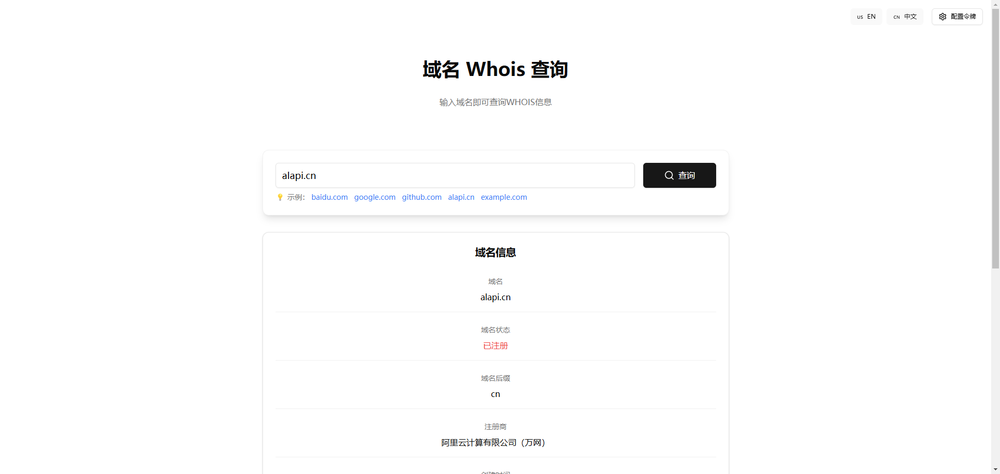

# Whois 域名查询工具 | Whois Domain Lookup Tool 🔍

[中文](/README.md) | [English](/README_en.md)

## 中文

## 快捷部署

 [](https://vercel.com/new/clone?repository-url=https://github.com/anhao/whois-lookup&demo-title=域名Whois查询工具&demo-description=一个现代化的域名WHOIS信息查询工具,可以快速查询域名的注册信息、到期时间、注册商等关键信息。&demo-url=https://www.alapi.cn)


 [](https://app.netlify.com/start/deploy?repository=https://github.com/anhao/whois-lookup)


### 项目介绍 📝



这是一个现代化的域名 WHOIS 信息查询工具,可以快速查询域名的注册信息、到期时间、注册商等关键信息。

### 主要特性 ✨

- 🌐 支持中英文双语界面
- 🔍 快速查询域名 WHOIS 信息
- 📱 响应式设计,支持移动端
- 🎨 现代化 UI 设计
- 🔒 安全的 API 令牌管理
- ⚡ 基于 Vite + React 开发
- 🌟 使用 ALAPI 的 API 查询域名信息

### 技术栈 🛠️

- React 18
- TypeScript
- Tailwind CSS
- shadcn/ui
- i18next
- Vite

### 本地开发 💻

1. 克隆项目

```bash
git clone https://github.com/anhao/whois-lookup.git
```

2. 安装依赖

```bash
npm install
```

3. 运行项目

```bash
npm run dev
```

### 部署教程 🚀

1. 构建项目 

```bash
npm run build
```


2. 部署到服务器

将 dist 目录下的文件上传到服务器，并访问对应的域名即可。

### 常见问题 🤔

1. 为什么查询不到域名信息？

- 请检查输入的域名是否正确，如果域名包含 http:// 或者 https:// 则去掉。
- 请检查 API 令牌是否正确。

2. 为什么查询速度很慢？

- 请检查 API 令牌是否正确。
- 请检查网络连接是否正常。


3. Token 是什么？

- Token 是 ALAPI 的 API 令牌，用于查询域名信息。
- 请在 [ALAPI](https://www.alapi.cn/) 注册账号并获取 API 令牌。


