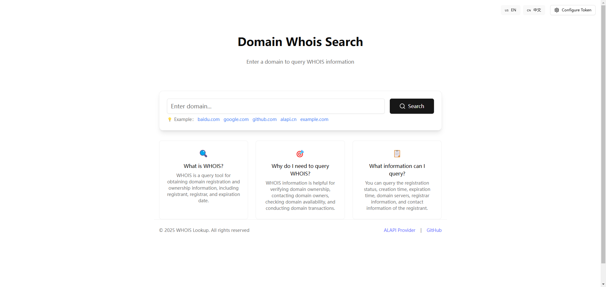

# Whois Domain Lookup Tool 🔍

[中文](/README.md) | [English](/README_en.md)

## English

## Quick Deployment

 [](https://vercel.com/new/clone?repository-url=https://github.com/anhao/whois-lookup&demo-title=Domain%20Whois%20Lookup%20Tool&demo-description=A%20modern%20domain%20WHOIS%20lookup%20tool%20that%20quickly%20retrieves%20key%20domain%20registration%20information%20including%20registration%20details,%20expiration%20time,%20registrar%20information,%20and%20more.&demo-url=https://www.alapi.cn)


 [](https://app.netlify.com/start/deploy?repository=https://github.com/anhao/whois-lookup)


### Project Introduction 📝



A modern domain WHOIS lookup tool that quickly retrieves key domain registration information including registration details, expiration time, registrar information, and more.

### Key Features ✨

- 🌐 Bilingual interface (Chinese/English)
- 🔍 Instant domain WHOIS lookup
- 📱 Responsive mobile-friendly design
- 🎨 Modern UI design
- 🔒 Secure API token management
- ⚡ Built with Vite + React
- 🌟 Use ALAPI's API to query domain information

### Tech Stack 🛠️

- React 18
- TypeScript
- Tailwind CSS
- shadcn/ui
- i18next
- Vite

### Local Development 💻

1. Clone repository

```bash
git clone https://github.com/anhao/whois-lookup.git
```

2. Install dependencies

```bash
npm install
```

3. Start development server

```bash
npm run dev
```

### Deployment Guide 🚀

1. Build project

```bash
npm run build
```

2. Deploy to server

Upload files from the `dist` directory to your server and access via your domain.

### FAQ 🤔

1. Why can't I get domain information?

- Verify the domain format is correct (remove http:// or https:// prefixes)
- Check your API token validity

2. Why is the query slow?

- Confirm API token is valid
- Check your network connection

3. What is the Token?

- This refers to the ALAPI platform's API token for WHOIS queries
- Register at [ALAPI](https://www.alapi.cn/) to obtain your API token